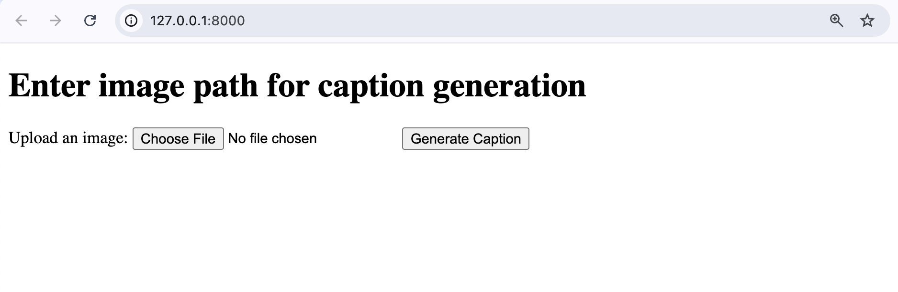

# 🚀 AI Image Captioning Web Application
> A Django-powered web application that automatically generates descriptive captions for images using state-of-the-art BLIP (Bootstrapping Language-Image Pre-training) model.


## 📌 Overview
This project is an intelligent web application that leverages the power of AI to automatically generate human-like captions for uploaded images. Built with Django and powered by Salesforce's BLIP model, it provides a user-friendly interface for image captioning tasks.

**Why it's useful:**
- Automates the tedious process of manually writing image descriptions
- Provides consistent, high-quality captions for content creators
- Useful for accessibility, content management, and social media automation

**Who it's for:**
- Content creators and marketers
- Web developers building AI-powered applications
- Researchers exploring computer vision and NLP integration
- Anyone needing automated image descriptions

## ✨ Features
- ✅ **AI-Powered Caption Generation** - Uses state-of-the-art BLIP model for accurate descriptions
- ✅ **Web-Based Interface** - Clean, responsive Django web application
- ✅ **Real-Time Processing** - Instant caption generation upon image upload
- ✅ **Multiple Image Support** - Handles various image formats (PNG, JPG, WEBP, etc.)
- ✅ **User-Friendly Design** - Simple upload and result display interface
- ✅ **Scalable Architecture** - Built with Django's robust framework

## 🖼️ Demo

### Input Images



### Generated Caption Output


The application processes the uploaded images and generates descriptive captions. The output image shows the results of the AI captioning process.

## ⚙️ Tech Stack
- **Languages**: Python 3.12+
- **Frameworks**: Django 5.1.4
- **AI/ML**: PyTorch, Transformers (Hugging Face)
- **Models**: BLIP (Bootstrapping Language-Image Pre-training)
- **Image Processing**: PIL (Python Imaging Library)
- **Database**: SQLite3
- **Frontend**: HTML, CSS
- **Development**: Virtual Environment (venv)

## 🚀 Getting Started

### ✅ Prerequisites
- Python 3.12 or higher
- pip package manager
- Git

### 📦 Installation

1. **Clone the repository**
   ```bash
   git clone https://github.com/yourusername/Django-web-application-image-captioning.git
   cd Django-web-application-image-captioning
   ```

2. **Create and activate virtual environment**
   ```bash
   python -m venv myenv
   source myenv/bin/activate  # On Windows: myenv\Scripts\activate
   ```

3. **Install dependencies**
   ```bash
   pip install -r requirements.txt
   ```

4. **Navigate to Django project**
   ```bash
   cd sentiment_project
   ```

5. **Run migrations**
   ```bash
   python manage.py migrate
   ```

6. **Start the development server**
   ```bash
   python manage.py runserver
   ```

7. **Open your browser and visit**
   ```
   http://127.0.0.1:8000/
   ```

## 📂 Project Structure
```
Django-web-application-image-captioning/
├── sentiment_project/          # Main Django project
│   ├── sentiment_app/         # Django application
│   │   ├── templates/         # HTML templates
│   │   │   ├── home.html      # Upload interface
│   │   │   └── result.html    # Results display
│   │   ├── views.py           # Business logic
│   │   ├── models.py          # Data models
│   │   └── admin.py           # Admin interface
│   ├── sentiment_project/     # Project settings
│   │   ├── settings.py        # Django configuration
│   │   ├── urls.py            # URL routing
│   │   └── wsgi.py            # WSGI configuration
│   ├── manage.py              # Django management script
│   └── db.sqlite3             # SQLite database
├── myenv/                     # Virtual environment
├── input.png                  # Sample input image
├── output.png                 # Sample output
└── README.md                  # This file
```

## 📈 How It Works

1. **Image Upload**: Users upload images through the web interface
2. **AI Processing**: The BLIP model analyzes the image content
3. **Caption Generation**: Natural language descriptions are generated
4. **Result Display**: Captions are presented in a user-friendly format

## 🛠️ Use Cases

- **Content Creation**: Automatically generate descriptions for blog posts, social media, and marketing materials
- **Accessibility**: Provide image descriptions for visually impaired users
- **E-commerce**: Generate product descriptions from product images
- **Social Media**: Automate caption generation for photo sharing platforms
- **Research**: Study computer vision and natural language processing integration
- **Education**: Teach AI concepts through practical web applications

## 🔧 Customization

### Adding New Models
You can easily integrate other captioning models by modifying the `views.py` file:

```python
# Example: Using a different model
from transformers import AutoProcessor, AutoModelForCausalLM

processor = AutoProcessor.from_pretrained("microsoft/git-base")
model = AutoModelForCausalLM.from_pretrained("microsoft/git-base")
```

### Styling
Customize the appearance by modifying the HTML templates in `sentiment_app/templates/`

## 🚀 Deployment

### Production Considerations
- Set `DEBUG = False` in settings.py
- Use environment variables for sensitive data
- Configure a production database (PostgreSQL, MySQL)
- Set up static file serving
- Use Gunicorn or uWSGI as WSGI server
- Configure Nginx as reverse proxy

### Docker Deployment
```dockerfile
FROM python:3.12-slim
WORKDIR /app
COPY requirements.txt .
RUN pip install -r requirements.txt
COPY . .
EXPOSE 8000
CMD ["python", "manage.py", "runserver", "0.0.0.0:8000"]
```

## 🙌 Author

**Nagendra Varma**
- 📧 Email: [saivarma2747@gmail.com](mailto:saivarma2747@gmail.com)
- 🔗 LinkedIn: [varma027](https://linkedin.com/in/varma027)

